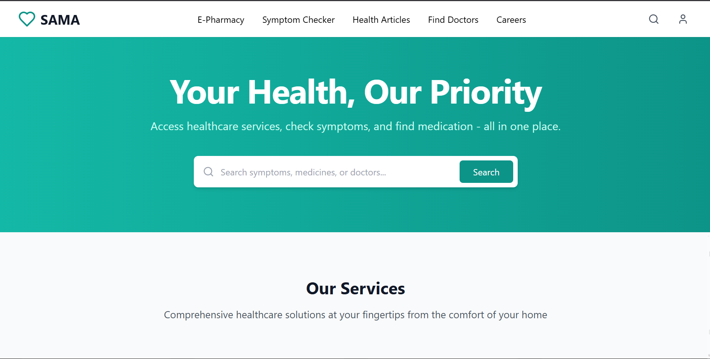

# SAMA Healthcare Platform

A comprehensive digital healthcare platform built with React, TypeScript, Tailwind CSS, and Node.js/Express.  
It provides multiple functionalities including E-Pharmacy, Symptom Checker, Doctor Booking, Health News, Careers, and a User Dashboard.

---

## Table of Contents

- [Overview](#overview)
- [Features](#features)
- [Project Structure](#project-structure)
- [Tech Stack](#tech-stack)
- [Screenshots](#screenshots)
- [Getting Started](#getting-started)
- [Core Components & Logic](#core-components--logic)
- [Backend Overview](#backend-overview)
- [Contributing](#contributing)
- [License](#license)

---

## Overview

SAMA is a digital healthcare platform that empowers users to manage their health journey.  
It integrates multiple healthcare services into a single web application, offering a seamless experience for users to check symptoms, order medicines, book doctor appointments, read health news, and manage their medical records.

---

## Features

- **E-Pharmacy:** Browse, search, and order medicines online.
- **Symptom Checker:** Interactive body map and form to analyze symptoms and get possible conditions.
- **Doctor Booking:** Find doctors and book appointments.
- **Health News:** Stay updated with the latest health articles.
- **Careers:** Explore job opportunities at SAMA.
- **User Dashboard:** Manage medical records, medications, and hospital visits.
- **Authentication:** User login and registration.

---

## Project Structure

```
.
├── backend/                # Node.js/Express backend (API, models, routes)
├── src/
│   ├── components/         # Reusable UI components
│   ├── epharmacy/          # E-Pharmacy pages and logic
│   ├── symptoms-checker/   # Symptom checker pages, body map, results
│   ├── doctors/            # Doctor-related pages
│   ├── news/               # Health news and articles
│   ├── careers/            # Careers page
│   ├── auth/               # Authentication pages
│   ├── pages/              # Main route pages
│   └── lib/                # Utilities and state management
├── public/                 # Static assets (images, mock data)
├── package.json            # Project dependencies and scripts
├── tailwind.config.js      # Tailwind CSS configuration
└── README.md               # Project documentation
```

---

## Tech Stack

- **Frontend:** React, TypeScript, Tailwind CSS, Vite
- **Backend:** Node.js, Express, MongoDB (Mongoose)
- **State Management:** React Context, custom hooks
- **UI Libraries:** Radix UI, Lucide Icons
- **API:** Axios for HTTP requests

---

## Screenshots


### Home Page


### Symptom Checker


### E-Pharmacy


### Dashboard


---

## Getting Started

### Prerequisites

- Node.js (v16+)
- npm

### Installation

```sh
git clone https://github.com/dipak-shaaki/SAMA-Final.git
cd sama-healthcare
npm install
```

### Running the Frontend

```sh
npm run dev
```

### Running the Backend

```sh
cd backend
npm install
npm run dev
```

---

## Core Components & Logic

### E-Pharmacy
- Handles medicine listing, search/filter, cart management, and checkout.
- Uses state hooks and a cart store for state management.

### Symptom Checker
- Multi-step form with an interactive body map, symptom input, and review.
- Analyzes symptoms and displays possible conditions and recommendations.

### Doctor Booking
- Lists doctors and allows booking appointments.

### User Dashboard
- Displays user medical history, medications, and hospital visits.
- Includes forms for editing records.

### Reusable UI Components
- Cards, tables, dialogs, sheets, forms, etc., built with Radix UI and Tailwind CSS.

### State Management
- Uses React Context and custom hooks for global state.

### API Integration
- Frontend communicates with backend via Axios.

---

## Backend Overview

- **Express.js API**
- **MongoDB Models:** User, MedicalRecord
- **Routes:**  
  - `/api/auth` for authentication  
  - `/api/users` for user management  
  - `/api/medical` for medical records

---

## Contributing

1. Fork the repository
2. Create your feature branch (`git checkout -b feature/YourFeature`)
3. Commit your changes (`git commit -am 'Add new feature'`)
4. Push to the branch (`git push origin feature/YourFeature`)
5. Open a Pull Request

---

## License

MIT

---
